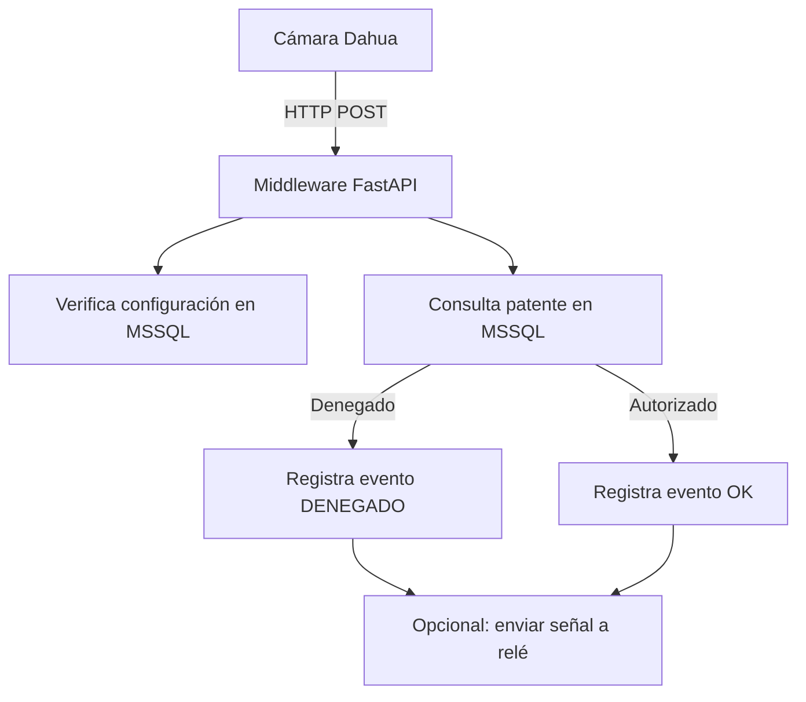

# 📷 Dahua LPR Middleware (Modo Push con Configuración Dinámica)

Este proyecto implementa un **middleware en Python** que recibe eventos LPR (Lectura de Patentes) desde **cámaras Dahua** mediante **HTTP POST**. Permite verificar si una patente detectada está autorizada, registrar el evento en una **base de datos MSSQL**, y tomar decisiones automáticas (ej: abrir una barrera).

## 🚀 Características clave

- Compatible con cámaras Dahua ANPR/LPR (ej: DHI-ITC431-RW1F-IRL8).
- Lectura **dinámica** de configuración de cámaras desde base de datos.
- Soporta múltiples cámaras simultáneamente.
- Estructura modular y extensible.
- Basado en **FastAPI** para alta concurrencia y bajo tiempo de respuesta.
- Puede ejecutarse como **servicio tipo daemon en Windows 10/11**.

---

## 🏗️ Arquitectura y flujo de la aplicación



### 🔧 Componentes principales

- **Cámara Dahua**: configurada para enviar eventos LPR en formato JSON por HTTP POST.
- **FastAPI Server**: recibe los eventos y responde en milisegundos.
- **MSSQL**:
  - `DahuaConfig`: define IP, usuario, contraseña y carpeta de imagenes por cámara.
  - `PatentesAutorizadas`: contiene las matrículas válidas.
  - `LPR_Logs`: almacena todos los eventos entrantes con resultado.

---

## 🗄️ Esquema de base de datos SQL Server

```sql
CREATE TABLE DahuaConfig (
    id INT PRIMARY KEY,
    cam_ip VARCHAR(100),
    cam_user VARCHAR(50),
    cam_password VARCHAR(50),
    snapshot_path VARCHAR(255)
);

CREATE TABLE PatentesAutorizadas (
    id INT PRIMARY KEY IDENTITY,
    Patente VARCHAR(20) UNIQUE,
    Habilitado BIT,
    Observaciones VARCHAR(255)
);

CREATE TABLE LPR_Logs (
    Id INT IDENTITY PRIMARY KEY,
    PlateNumber VARCHAR(20),
    EventTime DATETIME,
    ImageURL VARCHAR(255),
    Status VARCHAR(20)
);
```

---

## 📂 Estructura del proyecto

| Archivo               | Descripción                                                                 |
|------------------------|-----------------------------------------------------------------------------|
| `main.py`              | Servidor FastAPI que expone `/evento-lpr` y procesa eventos                |
| `db_access.py`         | Lógica de verificación de patentes y escritura de logs en MSSQL            |
| `config_reader.py`     | Obtiene configuración de cámara desde la tabla `DahuaConfig`               |
| `requirements.txt`     | Dependencias del entorno Python                                             |
| `README.md`            | Documentación completa del proyecto                                         |

---

## 🧪 Ejemplo de payload esperado desde la cámara

```json
{
  "plate": "ABC123",
  "timestamp": "2025-05-05T12:34:56Z",
  "image_url": "http://192.168.1.108/snapshot.jpg"
}
```

---

## 🔌 Configuración de la cámara Dahua

1. Acceder vía navegador a la IP de la cámara.
2. Ingresar a la sección de configuración ANPR o LPR.
3. Enviar datos por HTTP → método POST.
4. URL del servidor: `http://[IP_SERVIDOR]:8000/evento-lpr`
5. Formato: JSON.

---

## 🖥️ Instalación en entorno Windows 10/11

### 1. Instalar Python y dependencias

```bash
pip install -r requirements.txt
```

### 2. Ejecutar como aplicación

```bash
uvicorn main:app --host 0.0.0.0 --port 8000
```

### 3. (Opcional) Ejecutar como servicio en Windows

Usar `NSSM` (Non-Sucking Service Manager):

```bash
nssm install DahuaLPR
```

- Ruta del ejecutable: `python.exe`
- Argumentos: `-m uvicorn main:app --host 0.0.0.0 --port 8000`
- Directorio: carpeta del proyecto

También podés usar PyInstaller para compilar como `.exe`.

---

### 🔌 Conexión mediante ODBC (DSN en Windows)

Este proyecto utiliza `pyodbc`, que permite conectar a SQL Server mediante una cadena directa o a través de un **DSN (Data Source Name)** configurado en Windows.

#### ✅ ¿Qué es un DSN?

Un **DSN** es un alias de conexión configurado en Windows que guarda:
- El tipo de driver (ej: SQL Server o ODBC Driver 17 for SQL Server).
- El servidor SQL.
- Las credenciales (opcional).
- La base de datos predeterminada.

---

#### 🧩 Cómo configurar un DSN en Windows

1. Abrí el programa `ODBC Data Source Administrator`:
   - `odbcad32.exe` (32 o 64 bits según tu versión de Python).
2. Elegí *DSN de Usuario* o *DSN de Sistema*.
3. Hacé clic en **Agregar**.
4. Seleccioná el driver:  
   - `ODBC Driver 17 for SQL Server` o `SQL Server`.
5. Completá:
   - **Nombre del DSN**: `LPR_MSSQL` (por ejemplo).
   - **Servidor**: la IP o nombre del host SQL Server.
   - **Autenticación**: SQL o integrada (Windows).
   - **Base de datos predeterminada**: la que contiene tus tablas Dahua.

---

#### 🔄 Modificaciones en el código

En `config_reader.py` y `db_access.py`, cambiá la línea de conexión así:

```python
pyodbc.connect("DSN=LPR_MSSQL")
```

---

## 🧩 Instalación completa paso a paso

```bash
git clone https://github.com/tu_usuario/dahua_lpr_push.git
cd dahua_lpr_push
pip install -r requirements.txt
python main.py
```

---

## 🔄 Extensiones posibles

- Enviar eventos por MQTT o WebSocket.
- Visualizar estado de cámaras desde un dashboard web.
- Controlar relés (GPIO, USB, red) para abrir portones.
- Registrar imágenes en NAS o FTP.

---

## 🛡️ Seguridad

- Las cámaras deben estar en una red local o VPN segura.
- Si el servidor se expone a internet, usar HTTPS y token de validación.

---

## 📬 Contacto y soporte

Para soporte, colaboración o mejoras, crear un issue o fork en GitHub.

---

