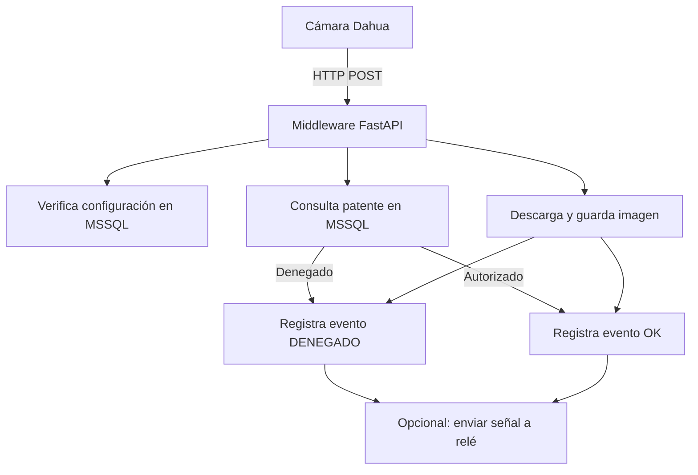

# 📷 Dahua LPR Middleware (Modo Push con Configuración Dinámica)

Este proyecto implementa un **middleware en Python** que recibe eventos LPR (Lectura de Patentes) desde **cámaras Dahua** mediante **HTTP POST**. Permite verificar si una patente detectada está autorizada, registrar el evento en una **base de datos MSSQL**, guardar imágenes localmente y tomar decisiones automáticas (ej: abrir una barrera).

## 🚀 Características clave

- Compatible con cámaras Dahua ANPR/LPR (ej: DHI-ITC431-RW1F-IRL8).
- Lectura **dinámica** de configuración de cámaras desde base de datos.
- **Guardado automático** de imágenes de reconocimiento en sistema de archivos local.
- Estructura de carpetas organizada por fechas para fácil acceso.
- Soporta múltiples cámaras simultáneamente.
- Sistema de logging completo para seguimiento y diagnóstico.
- Estructura modular y extensible.
- Basado en **FastAPI** para alta concurrencia y bajo tiempo de respuesta.
- Puede ejecutarse como **servicio tipo daemon en Windows 10/11**.
- Endpoint de salud para monitoreo del servicio.

---

## 🏗️ Arquitectura y flujo de la aplicación



### 🔧 Componentes principales

- **Cámara Dahua**: configurada para enviar eventos LPR en formato JSON por HTTP POST.
- **FastAPI Server**: recibe los eventos y responde en milisegundos.
- **MSSQL**:
  - `DahuaConfig`: define IP, usuario, contraseña, snapshot_path y carpeta de imágenes local.
  - `PatentesAutorizadas`: contiene las matrículas válidas.
  - `LPR_Logs`: almacena todos los eventos entrantes con resultado y ruta de imagen local.
- **Sistema de archivos**: almacena las imágenes organizadas por fecha.
- **Sistema de logging**: registra operaciones y errores para diagnóstico.

---

## 🗄️ Esquema de base de datos SQL Server

```sql
CREATE TABLE DahuaConfig (
    id INT PRIMARY KEY,
    cam_ip VARCHAR(100),
    cam_user VARCHAR(50),
    cam_password VARCHAR(50),
    snapshot_path VARCHAR(255),       -- URL base para construir URLs de imágenes
    images_folder VARCHAR(255) DEFAULT 'C:\LPR_Images' -- Carpeta local para guardar imágenes
);

CREATE TABLE PatentesAutorizadas (
    id INT PRIMARY KEY IDENTITY,
    Patente VARCHAR(20) UNIQUE,
    Habilitado BIT,
    Observaciones VARCHAR(255)
);

CREATE TABLE LPR_Logs (
    Id INT IDENTITY PRIMARY KEY,
    PlateNumber VARCHAR(20),
    EventTime DATETIME,
    ImageURL VARCHAR(255),
    Status VARCHAR(20),
    LocalImagePath VARCHAR(255)        -- Ruta donde se guardó la imagen localmente
);
```

---

## 📂 Estructura del proyecto

| Archivo               | Descripción                                                                 |
|------------------------|-----------------------------------------------------------------------------|
| `main.py`              | Servidor FastAPI que expone `/evento-lpr` y `/health`                      |
| `db_access.py`         | Lógica de verificación de patentes y escritura de logs en MSSQL            |
| `config_reader.py`     | Obtiene configuración de cámara desde la tabla `DahuaConfig`               |
| `image_handler.py`     | Gestiona la descarga y almacenamiento de imágenes                          |
| `requirements.txt`     | Dependencias del entorno Python                                            |
| `README.md`            | Documentación completa del proyecto                                         |
| `lpr_middleware.log`   | Archivo de log generado automáticamente                                    |

---

## 🧪 Ejemplo de payload esperado desde la cámara

```json
{
  "plate": "ABC123",
  "timestamp": "2025-05-05T12:34:56Z",
  "image_url": "http://192.168.1.108/snapshot.jpg"
}
```

### Notas sobre el campo `image_url`

- Si es una URL completa (comienza con `http://` o `https://`), se utiliza directamente.
- Si es una ruta parcial (ej: `/snapshot.jpg`), se construye la URL completa utilizando `snapshot_path` o `cam_ip` de la configuración.

---

## 🔌 Configuración de la cámara Dahua

1. Acceder vía navegador a la IP de la cámara.
2. Ingresar a la sección de configuración ANPR o LPR.
3. Enviar datos por HTTP → método POST.
4. URL del servidor: `http://[IP_SERVIDOR]:8000/evento-lpr`
5. Formato: JSON.

---

## 🖥️ Instalación en entorno Windows 10/11

### 1. Instalar Python y dependencias

```bash
pip install -r requirements.txt
```

### 2. Configurar la base de datos

Asegurarse de que las tablas incluyan los campos necesarios:
- Campo `snapshot_path` en la tabla `DahuaConfig` (URL base para construir URLs de imágenes)
- Campo `images_folder` en la tabla `DahuaConfig` (carpeta local para guardar imágenes)
- Campo `LocalImagePath` en la tabla `LPR_Logs` (ruta donde se guardó la imagen)

Si las tablas ya existen, ejecutar:

```sql
ALTER TABLE DahuaConfig
ADD snapshot_path VARCHAR(255);

ALTER TABLE DahuaConfig
ADD images_folder VARCHAR(255) DEFAULT 'C:\LPR_Images';

ALTER TABLE LPR_Logs
ADD LocalImagePath VARCHAR(255);
```

### 3. Ejecutar como aplicación

```bash
uvicorn main:app --host 0.0.0.0 --port 8000
```

### 4. (Opcional) Ejecutar como servicio en Windows

Usar `NSSM` (Non-Sucking Service Manager):

```bash
nssm install DahuaLPR
```

- Ruta del ejecutable: `python.exe`
- Argumentos: `-m uvicorn main:app --host 0.0.0.0 --port 8000`
- Directorio: carpeta del proyecto

También podés usar PyInstaller para compilar como `.exe`.

---

### 🔌 Conexión mediante ODBC (DSN en Windows)

Este proyecto utiliza `pyodbc`, que permite conectar a SQL Server mediante una cadena directa o a través de un **DSN (Data Source Name)** configurado en Windows.

#### ✅ ¿Qué es un DSN?

Un **DSN** es un alias de conexión configurado en Windows que guarda:
- El tipo de driver (ej: SQL Server o ODBC Driver 17 for SQL Server).
- El servidor SQL.
- Las credenciales (opcional).
- La base de datos predeterminada.

---

#### 🧩 Cómo configurar un DSN en Windows

1. Abrí el programa `ODBC Data Source Administrator`:
   - `odbcad32.exe` (32 o 64 bits según tu versión de Python).
2. Elegí *DSN de Usuario* o *DSN de Sistema*.
3. Hacé clic en **Agregar**.
4. Seleccioná el driver:  
   - `ODBC Driver 17 for SQL Server` o `SQL Server`.
5. Completá:
   - **Nombre del DSN**: `LPR_MSSQL` (por ejemplo).
   - **Servidor**: la IP o nombre del host SQL Server.
   - **Autenticación**: SQL o integrada (Windows).
   - **Base de datos predeterminada**: la que contiene tus tablas Dahua.

---

## 📁 Estructura de almacenamiento de imágenes

Las imágenes capturadas se almacenan siguiendo esta estructura:

```
C:\LPR_Images\  (configurable desde la tabla DahuaConfig)
  └── 2025-05-05\  (carpeta con la fecha del evento)
       ├── ABC123_123456.jpg  (formato: PATENTE_HHMMSS.jpg)
       └── DEF456_124512.jpg
```

Cada imagen se nombra usando la patente detectada y la hora del evento, lo que facilita la búsqueda y organización.

---

## 📊 Sistema de logging

El middleware implementa un sistema de logging completo que registra:
- Eventos recibidos
- Verificaciones de patentes
- Descargas de imágenes
- Errores y excepciones

Los logs se almacenan en el archivo `lpr_middleware.log` en la carpeta del proyecto.

---

## 🧩 Instalación completa paso a paso

```bash
git clone https://github.com/tu_usuario/dahua_lpr_push.git
cd dahua_lpr_push
pip install -r requirements.txt
python main.py
```

## 🔍 Monitoreo del servicio

El endpoint `/health` puede utilizarse para verificar que el servicio está funcionando correctamente:

```bash
curl http://localhost:8000/health
```

Respuesta esperada:
```json
{
  "status": "ok",
  "timestamp": "2025-05-05T12:34:56.789"
}
```

---

## 🔁 Mantenimiento del almacenamiento

Para evitar que el disco se llene con imágenes antiguas, se recomienda:

1. Implementar una tarea programada de Windows que elimine las carpetas de imágenes más antiguas que cierto período.
2. Monitorear el espacio en disco disponible.

Ejemplo de script para borrar imágenes antiguas:

```batch
@echo off
forfiles /p "C:\LPR_Images" /d -90 /c "cmd /c if @isdir==TRUE rmdir /s /q @path"
```

Esto eliminaría las carpetas con más de 90 días de antigüedad.

---

## 🔄 Extensiones posibles

- Enviar eventos por MQTT o WebSocket.
- Visualizar estado de cámaras desde un dashboard web.
- Controlar relés (GPIO, USB, red) para abrir portones.
- Registrar imágenes en NAS o FTP.
- Implementar análisis de imágenes con IA para detectar otros atributos del vehículo.

---

## 🛡️ Seguridad

- Las cámaras deben estar en una red local o VPN segura.
- Si el servidor se expone a internet, usar HTTPS y token de validación.
- Considerar encriptar las credenciales almacenadas en la base de datos.
- Revisar periódicamente los logs para detectar intentos de acceso no autorizados.

---

## 📬 Contacto y soporte

Para soporte, colaboración o mejoras, crear un issue o fork en GitHub.

---
